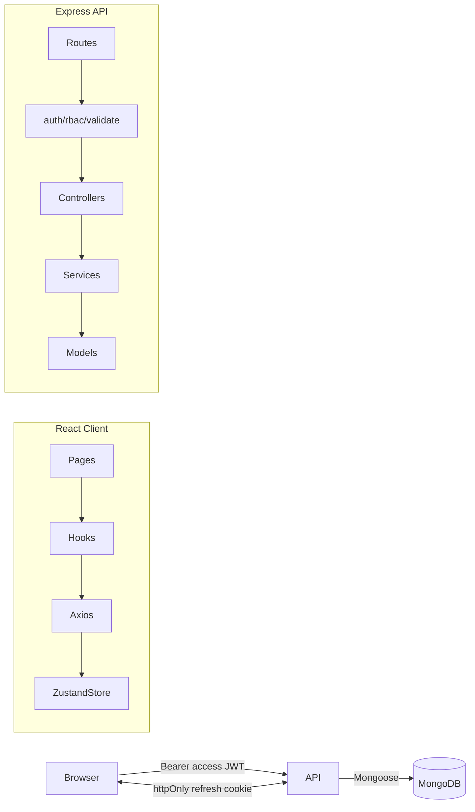

# Team Task Manager

A production-ready full-stack team collaboration app — projects, role-based members, tasks with a Kanban board, optimistic-locked edits, JWT auth with refresh-token rotation, and a clean React UI built on shadcn/ui.

> **Demo accounts (after running `npm run seed`):**
> - `admin@demo.com` / `Admin@123`
> - `member@demo.com` / `Member@123`

## Tech stack

| Layer | Stack |
|-------|-------|
| Frontend | React 18, Vite, JavaScript, Tailwind CSS, shadcn/ui (Radix), TanStack Query, Zustand, React Router v6, react-hook-form + Zod, sonner, @dnd-kit, date-fns |
| Backend | Node.js 20, Express, Mongoose, Zod, JWT, bcryptjs, helmet, cors, express-rate-limit, express-mongo-sanitize, cookie-parser |
| Database | MongoDB |
| Deploy | Railway (monorepo: `server` + `client` + MongoDB plugin) |

## Features

- Email + password signup / login with JWT access tokens + httpOnly refresh-cookie rotation
- Single in-flight refresh on the client (concurrent 401s share one refresh)
- Projects with role-based members (`ADMIN` / `MEMBER`), owner-protected destructive actions
- Tasks with status, priority, due date, assignee, full-text search, filtering, and pagination
- Drag-and-drop Kanban board (status moves) with optimistic locking on `updatedAt`
- Cascade-deletion of tasks and activity logs when a project is removed
- Dashboard with personal counts, my-tasks list, and project summaries
- Dark mode toggle persisted in localStorage
- Mobile responsive (sheet menu, scrollable board)
- Toasts on every mutation (success + error)

## Project structure

```
team-task-manager/
├── client/            # React + Vite app
│   ├── src/
│   │   ├── components/  (ui, auth, layout, tasks, projects, members, dashboard)
│   │   ├── pages/
│   │   ├── hooks/        (TanStack Query hooks)
│   │   ├── lib/          (axios, queryClient, utils)
│   │   ├── store/        (Zustand: auth, theme)
│   │   ├── schemas/      (Zod schemas)
│   │   ├── App.jsx
│   │   ├── main.jsx
│   │   └── index.css
│   ├── tailwind.config.js
│   ├── vite.config.js
│   └── package.json
├── server/            # Express + Mongoose API
│   ├── src/
│   │   ├── config/       (env, db)
│   │   ├── models/       (User, Project, Task, ActivityLog, RefreshToken)
│   │   ├── validators/   (Zod schemas)
│   │   ├── middleware/   (auth, rbac, validate, error, rateLimit)
│   │   ├── services/
│   │   ├── controllers/
│   │   ├── routes/
│   │   ├── utils/        (jwt, cookies, ApiError, transactions...)
│   │   ├── app.js
│   │   ├── index.js
│   │   └── seed.js
│   └── package.json
├── postman_collection.json
├── railway.json
└── README.md
```

## Local setup

Prerequisites: **Node 20+** and a running MongoDB (`mongodb://127.0.0.1:27017` is the default).

```bash
# 1. Server
cd server
cp .env.example .env       # adjust values
npm install
npm run seed               # creates demo users + project + tasks
npm run dev                # http://localhost:5000

# 2. Client (new terminal)
cd client
cp .env.example .env       # VITE_API_URL=http://localhost:5000/api
npm install
npm run dev                # http://localhost:5173
```

Open http://localhost:5173 and sign in with one of the demo accounts.

## Environment variables

### `server/.env`

| Key | Description | Example |
|-----|-------------|---------|
| `PORT` | API port | `5000` |
| `NODE_ENV` | `development` / `production` / `test` | `development` |
| `MONGO_URL` | MongoDB connection URL | `mongodb://127.0.0.1:27017/team_task_manager` |
| `JWT_ACCESS_SECRET` | ≥ 16 chars | `(long random string)` |
| `JWT_REFRESH_SECRET` | ≥ 16 chars | `(long random string)` |
| `JWT_ACCESS_EXPIRES_IN` | Access TTL | `15m` |
| `JWT_REFRESH_EXPIRES_IN` | Refresh TTL | `7d` |
| `CLIENT_URL` | CORS origin | `http://localhost:5173` |
| `COOKIE_SECRET` | Cookie signing secret (≥16) | `(long random string)` |

### `client/.env`

| Key | Example |
|-----|---------|
| `VITE_API_URL` | `http://localhost:5000/api` |

## API

> All routes are prefixed with `/api`. Protected endpoints expect `Authorization: Bearer <accessToken>`. The refresh token is set as an httpOnly cookie at `/api/auth`.

### Auth (`/api/auth`)

| Method | Path | Description |
|--------|------|-------------|
| POST | `/signup` | `{ email, password, name }` → `{ user, accessToken }` + cookie |
| POST | `/login` | `{ email, password }` → `{ user, accessToken }` + cookie |
| POST | `/refresh` | (cookie) → `{ accessToken }` + rotated cookie |
| POST | `/logout` | Clears cookie + invalidates DB token |
| GET | `/me` | Current user |

### Projects (`/api/projects`)

| Method | Path | Notes |
|--------|------|-------|
| GET | `/` | All projects you're a member of |
| POST | `/` | Body `{ name, description }`. You become owner + admin |
| GET | `/:id` | Project + populated members + task stats |
| PATCH | `/:id` | Admin only |
| DELETE | `/:id` | Owner only — cascades tasks + activity |

### Members (`/api/projects/:id/members`)

| Method | Path | Notes |
|--------|------|-------|
| POST | `/` | Admin. `{ email, role }`. 404 if email isn't registered |
| PATCH | `/:userId` | Admin. `{ role }`. Cannot demote last admin |
| DELETE | `/:userId` | Admin removes anyone except owner; user can self-leave; assigned tasks → null |

### Tasks

| Method | Path | Notes |
|--------|------|-------|
| GET | `/api/projects/:id/tasks` | `?status&assignee&priority&overdue&search&page&limit` |
| POST | `/api/projects/:id/tasks` | Validates assignee is a project member |
| GET | `/api/tasks/:id` | Detail |
| PATCH | `/api/tasks/:id` | Optimistic lock via `updatedAt`. Assignees can only change `status` |
| DELETE | `/api/tasks/:id` | Project admin or task creator |

### Dashboard / Health

| Method | Path |
|--------|------|
| GET | `/api/dashboard?page&limit` |
| GET | `/api/health` |

A complete Postman collection is included as `postman_collection.json`.

## Architecture



## Deployment to Railway

The repo includes a `railway.json` at the root and per-service Railway configs. The simplest path:

1. **Provision MongoDB** — In Railway's project, add the **MongoDB** plugin. Copy the connection string into the server service as `MONGO_URL`.
2. **Server service**
   - Root directory: `server`
   - Start: `node src/index.js`
   - Healthcheck path: `/api/health`
   - Env: `MONGO_URL`, `JWT_ACCESS_SECRET`, `JWT_REFRESH_SECRET`, `COOKIE_SECRET`, `CLIENT_URL` (the Railway URL of the client service), `NODE_ENV=production`. `PORT` is auto-injected.
3. **Client service**
   - Root directory: `client`
   - Build: `npm install && npm run build`
   - Start: `npm run start` (`vite preview` listening on `$PORT`)
   - Env: `VITE_API_URL` (the Railway URL of the server service + `/api`).
4. After both services are deployed, set the server's `CLIENT_URL` to the client's URL and redeploy so CORS allows it.

## Edge cases handled

- Duplicate signup → 409 with a generic message (no email enumeration)
- Wrong password / unknown email → identical 401 message
- Concurrent 401s on the client share a single in-flight `/refresh` call
- Refresh tokens hashed (SHA-256) before storage, with TTL-indexed expiry
- Refresh-token reuse is prevented by atomic `findOneAndUpdate({used:false})`
- Member removal sets all of their assigned tasks in that project to `null` (in a transaction when possible; falls back to two ops on standalone Mongo)
- Last admin demotion / removal is rejected
- Project owner can never be removed; only the owner can delete the project (cascades tasks + activity)
- Optimistic locking on tasks: clients send `updatedAt`, mismatch returns 409
- Assignees can only update `status`; admins/creators can edit anything
- All ObjectIds validated, all bodies Zod-validated, NoSQL injection blocked by `express-mongo-sanitize`
- Helmet, strict CORS allowlist, rate limiting (auth: 5/15m, global: 100/15m)
- Refresh cookie: `httpOnly`, `secure` + `sameSite=strict` in production, scoped to `/api/auth`
- Password is `select: false` — never returned anywhere
- Env validated with Zod; the API crashes early on misconfiguration

## Future improvements

- Activity feed UI (the model + cascade are already wired)
- File attachments / comments on tasks
- Real-time updates via WebSockets / SSE
- Email invites for unregistered users
- E2E tests (Playwright) and API tests (Vitest + supertest)
